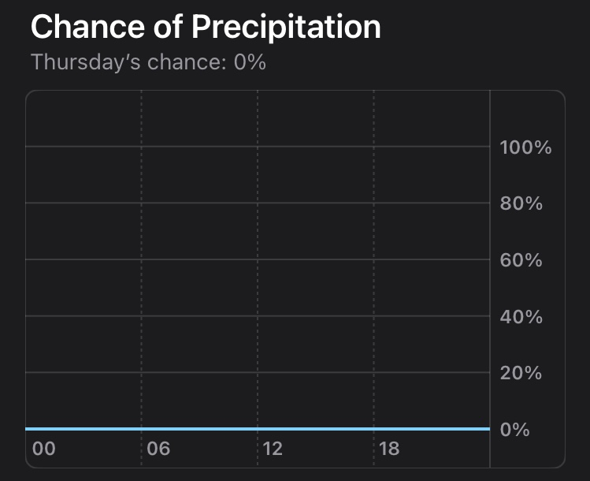
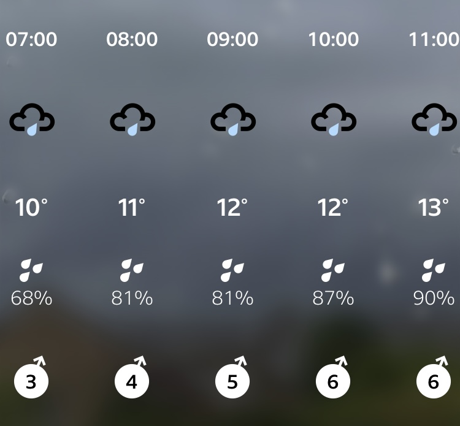
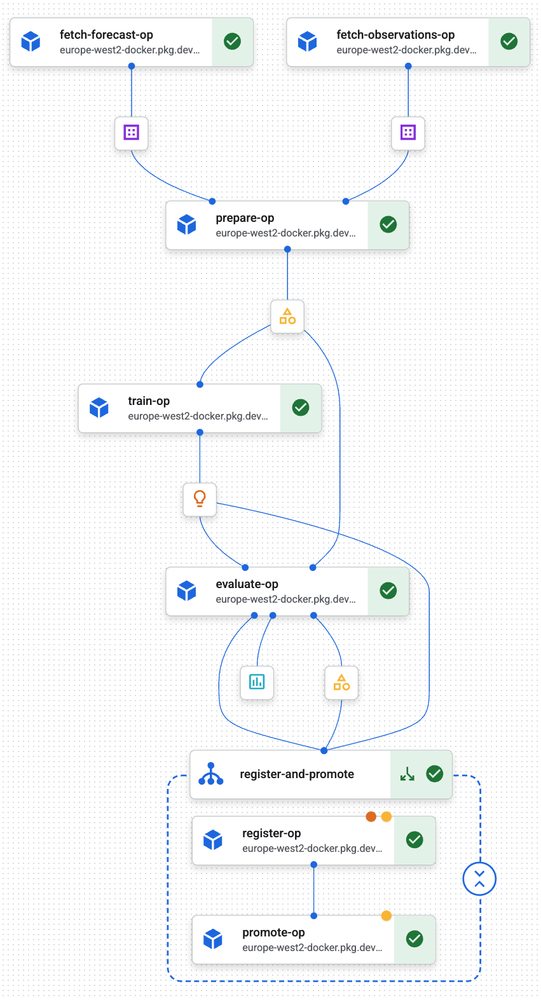

# Will it rain?

Local rain forecasting for where I live. Uses historical weather forecasts along
with research-grade weather station data to get improved rain forecasting for my
home.

Because the forecast prediction is tied to the vicinity of the specific weather
station location, the app does not show the forecast for the user's location,
only for the static location of the weather station. This is useful to me,
because it is where I live.

## Motivation

The two weather forecasts I regularly check for short-term weather forecasts are
systematically over-optimistic and pessimistic. Apple Weather underpredicts
rain, while BBC weather overpredicts.

<figure align="center">
  
 

  <figcaption align="center"><table align="center" width="80%"><tr><td align="center"><em>Forecasts from Apple Weather (left) and BBC Weather (right)
  for the same time. Apple predicts dry, BBC predicts likely to rain. This is
  representative of what I have observed as systematic optimistic/pessimistic variation between the two.</em></td></tr></table></figcaption>
</figure>
 

Since these are regular variances, not completely random, it suggests that with
accurate local data for rainfall, a model can learn a more accurate prediction
from the two forecasts.

There happens to be a research-grade weather station a few hundred metres from
where I live, with open and accessible data. This gives a very good set of real
observations to train against.

Unfortunately, neither Apple nor the BBC publish their historic forecasts, so
without spending a few years collecting such forecast data in preparation, we
can't use the Apple and BBC forecasts themselves.

But the underlying models which I think they use are made available through
Open-Meteo. Apple's [Weather data
sources](https://support.apple.com/en-gb/105038) lists ECMWF and The Met Office,
while [BBC Weather](https://www.bbc.co.uk/weather) lists The Met Office as a
major source.

## Data sources

Two upstream APIs, both queried on-demand inside the weekly training pipeline:

- **[Open-Meteo historical-forecast API](https://open-meteo.com/en/docs/historical-forecast-api)** for hourly forecast features. Two
  models are fetched in parallel — the UK Met Office's
  `ukmo_uk_deterministic_2km` and ECMWF's `ecmwf_ifs`. Training uses the
  historical-forecast endpoint, which shows the one-hour ahead forecast for each
  hourly interval over the past several years.
- **[COSMOS UK](https://cosmos.ceh.ac.uk/)** research-grade weather station data
  via the CEH endpoint, pulling half-hourly pluvio precipitation readings from
  the site near my home. These observations are the ground truth that the model
  is trained to predict.

## Model and training

The target is binary: **will it rain in the next 4 hours?**, where "rain"
means cumulative precipitation of **≥ 0.1 mm** measured by the COSMOS pluvio
over the 4-hour window starting at the anchor hour. That same window and
threshold are used for the persistence and naive-forecast baselines that the
trained model has to beat.

Features at each anchor hour are the nine Open-Meteo variables from both
forecast models, plus lag-1/2/3-hour copies of each, plus `hour_of_day` and
`month`. The classifier is a LightGBM binary model with early stopping on a
held-out validation slice. Its raw probabilities are then run through an
isotonic regression calibrator fitted on the same validation slice, which
corrects magnitude drift between the (drier) training period and val/test,
and the decision threshold is chosen to maximise F1 on the calibrated val
predictions. Splits are chronological 70/15/15 over the full available
window — no shuffling, since temporal leakage would flatter the test score.

Training runs as a Vertex AI Pipeline every Sunday at 02:00 UTC. Each run
re-fetches data, retrains from scratch, and evaluates a challenger model
against the current production champion on the same held-out test set; the
`production` alias in the Model Registry only moves forward if the
challenger beats the champion by a margin.

<figure align="center">
  
  <figcaption align="center"><table align="center" width="80%"><tr><td align="center"><em>Vertex AI training pipeline. Fetches historic forecasts and
  real observations, then prepares training data (features and labels) from
  these. Runs model training using the new data set, then evaluates the new
  model. The register and promote step is gated on the model performing better
  than the persistence baseline. If gate condition passes, the new model is
  registered, and promoted only if the new model (challenger) performs better
  than the existing production model (champion) on the same test data set.</em></td></tr></table></figcaption>
</figure>
 

## Frontend

When the site is loaded, it calls `/api/predict` once and renders a plain,
straightforward prediction of whether there will be rain or not in the next four
hours (a four hour window, starting at the most recent hour).

Additional details are displayed, such as calibrated rain probability and the
model's decision threshold.
